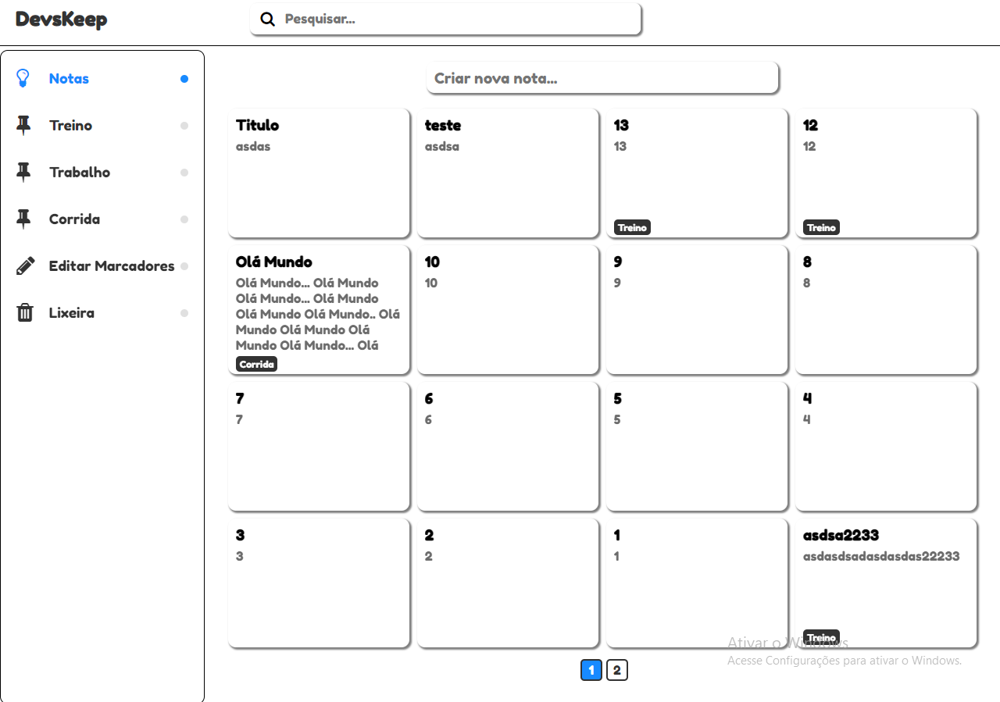
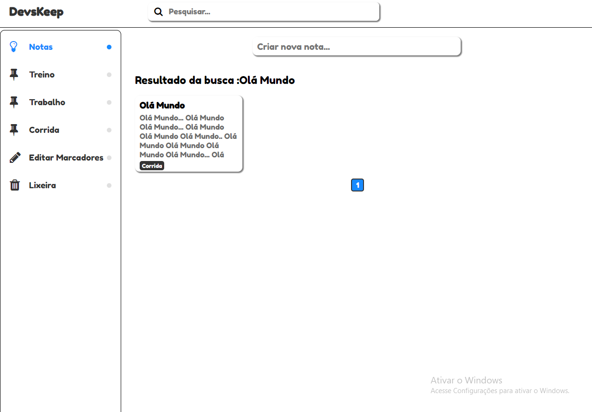
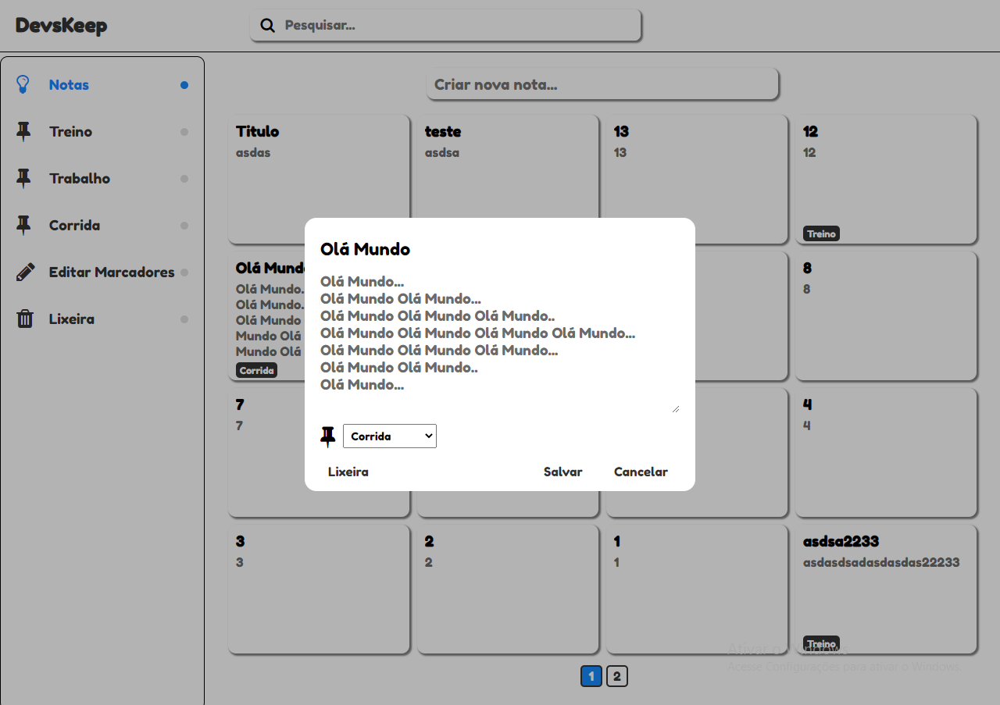
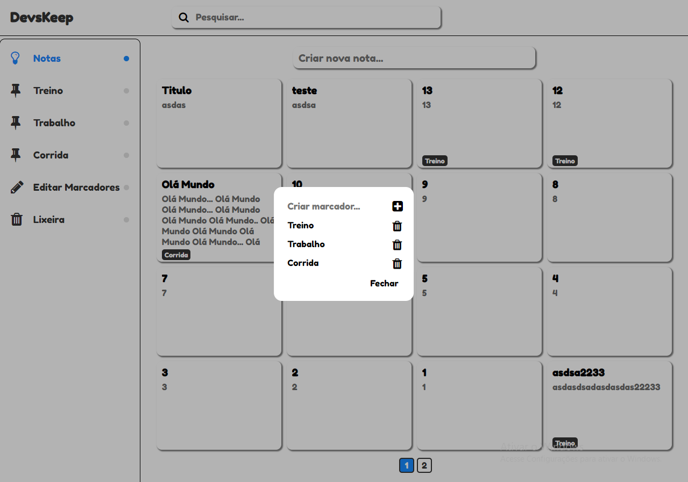

<h1 align="center">Devs Keep</h1>

O projeto é  simplificado do Keep da Google 

## Imagens de Demonstração

    
    
    
    

 

## Instalação
Você pode clonar o repositório ou baixar o .zip

## Configuração
Criar um Banco de Dados com nome devskeep ou outro nome qualquer 

Importar arquivo devskeep.sql no Banco de Dados 

Config.php tem as configurações do Banco de Dados